# FractionFi: Tokenized Bond Liquidity Platform

**Revolutionizing Fixed Income Markets Through Blockchain & AI**

FractionFi is a comprehensive tokenized bond trading platform that democratizes access to fixed income markets through blockchain technology, AI-powered matching, and Digital Public Infrastructure (DPI) integration. Built with Next.js, FastAPI, PostgreSQL, Ethereum, and advanced AI/ML capabilities.

## 🎯 Problem Statement

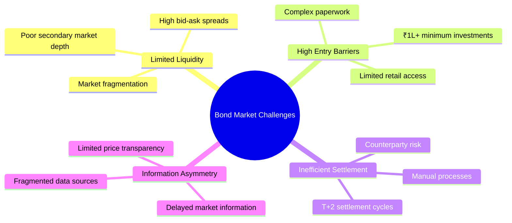

## � Platform Flow Diagrams

### User Onboarding & KYC Flow

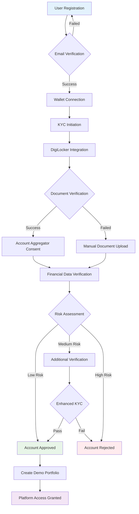

### Bond Tokenization Flow

```mermaid
flowchart LR
    subgraph "Issuer Side"
        A[Bond Issuance] --> B[Legal Documentation]
        B --> C[SEBI Approval]
        C --> D[Smart Contract Deployment]
    end
    
    subgraph "Platform Processing"
        D --> E[Token Minting]
        E --> F[Metadata Assignment]
        F --> G[Fractional Units Creation]
        G --> H[Liquidity Pool Setup]
    end
    
    subgraph "Market Ready"
        H --> I[Order Book Creation]
        I --> J[Market Making Bots]
        J --> K[Trading Launch]
    end
    
    subgraph "Ongoing Operations"
        K --> L[Coupon Distribution]
        L --> M[Maturity Settlement]
        M --> N[Token Burn]
    end
    
    style A fill:#fff3e0
    style K fill:#e8f5e8
    style N fill:#ffebee
```

### Trading Workflow

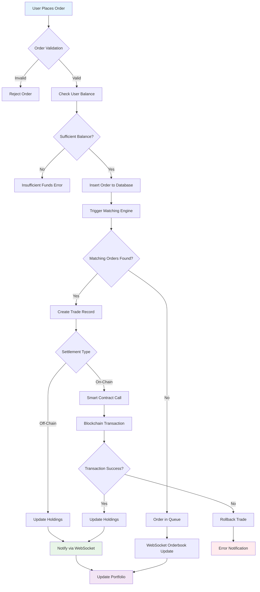

### AI/ML Processing Flow

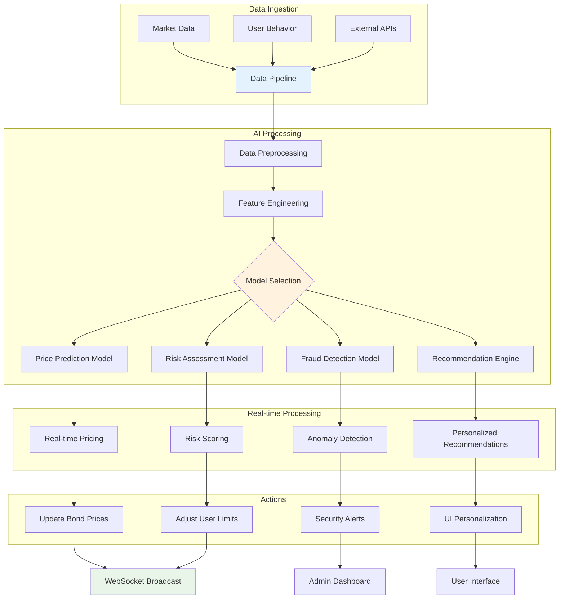

## �💡 Solution Overview

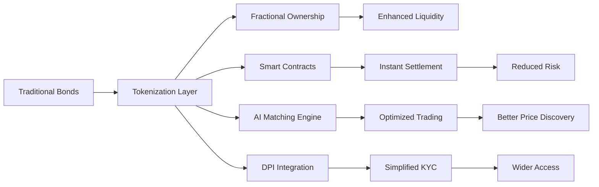


### Portfolio Management Flow

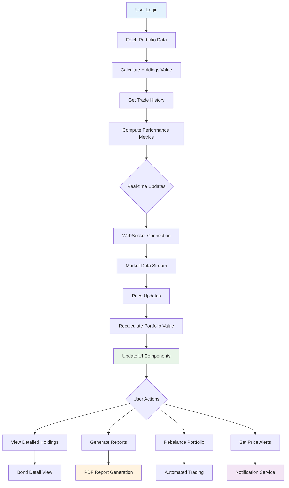

### Error Handling & Recovery Flow

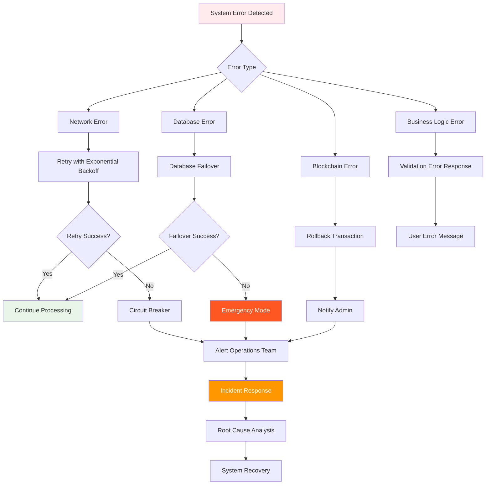

### Compliance & Audit Flow

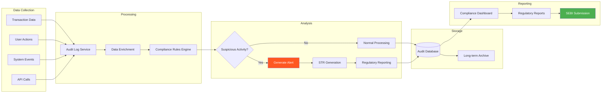

## 🏗️ Technology Architecture

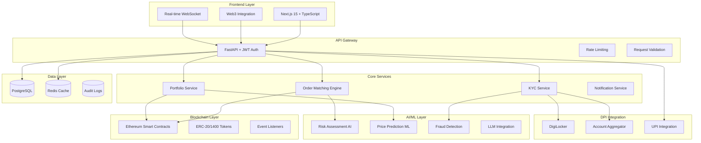

## 📊 Market Impact Analysis

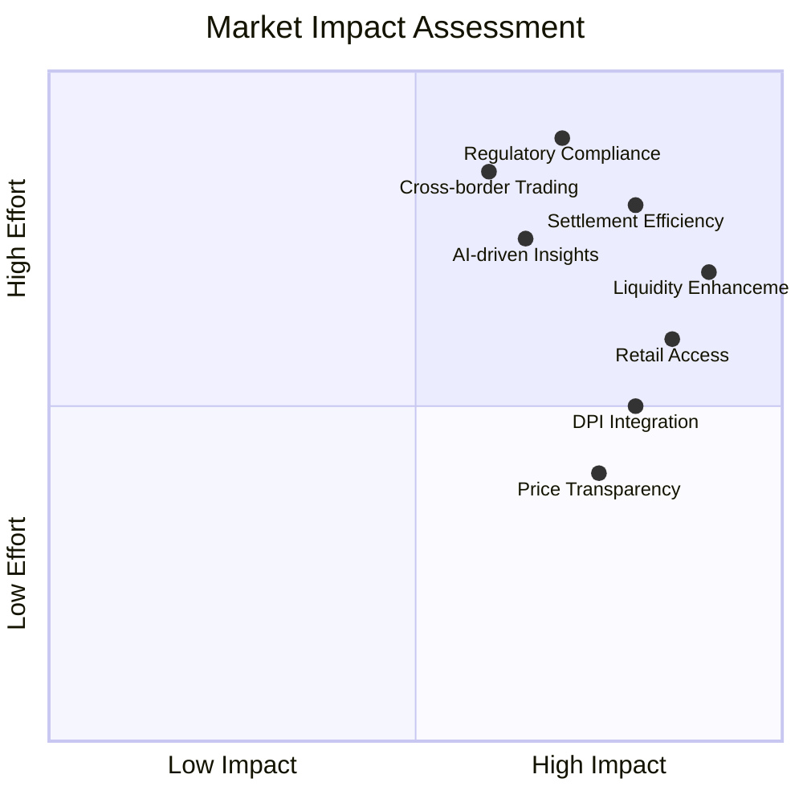

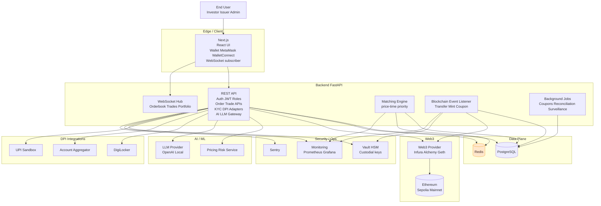


## 📊 Market Impact Analysis


## 🔐 Cybersecurity Framework

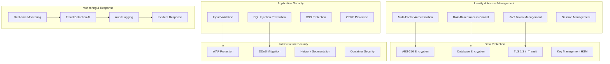

## 📈 Scalability Architecture

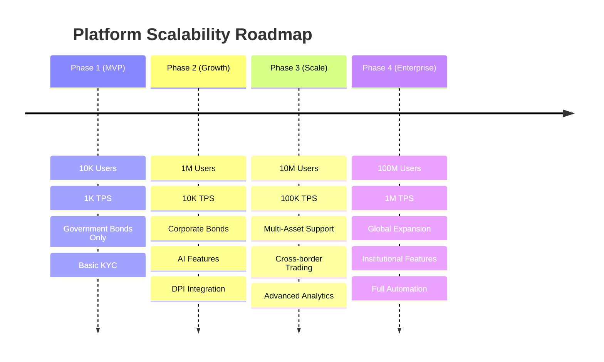

## 🏛️ SEBI Alignment Framework

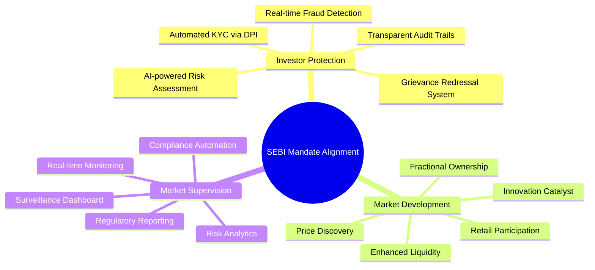

## 🚀 Implementation Roadmap

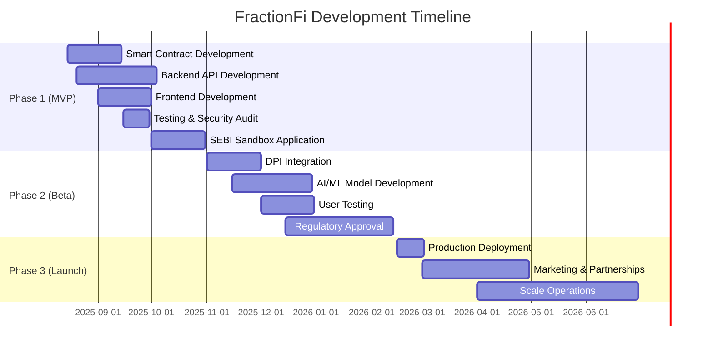

## 💰 Business Model & Revenue Streams

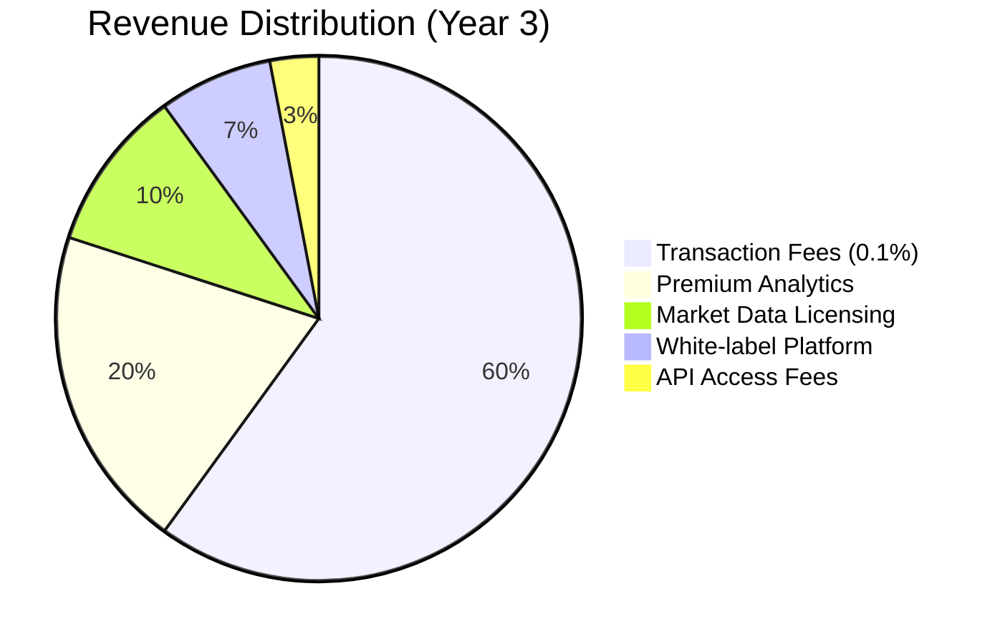

## 🌍 Market Penetration Strategy

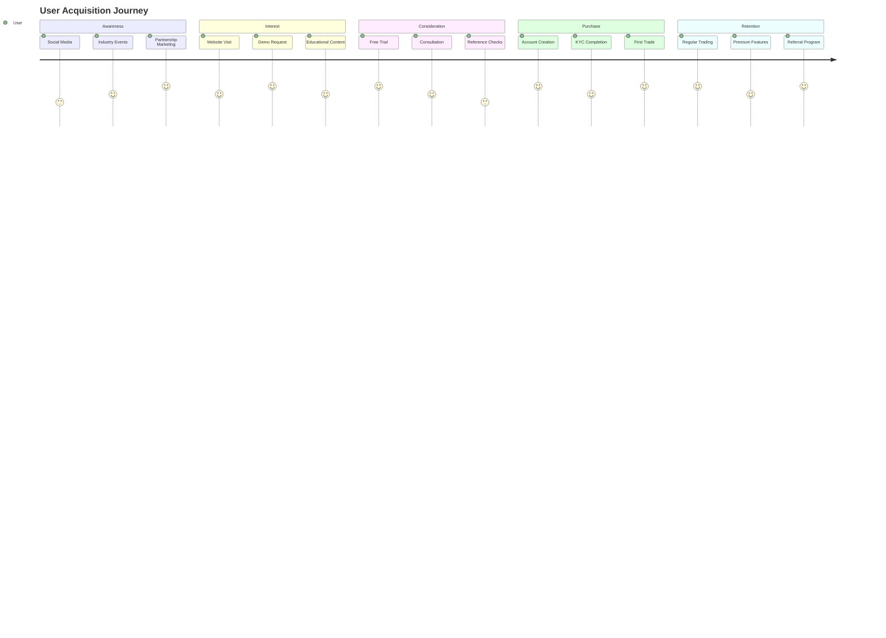

## End‑to‑end order lifecycle (sequence)

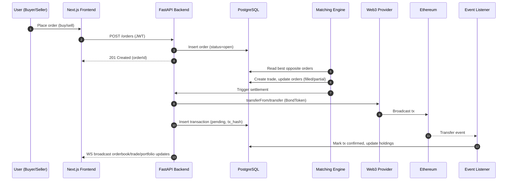


## Order matching and settlement logic (flow)

```mermaid
flowchart TB
  A[New Order] --> B{Validate<br/>JWT KYC balance}
  B -- fail --> X[Reject 4xx]
  B -- ok --> C[Insert into orders<br/>status open]
  C --> D[Match engine picks order]
  D --> E{Opposite orders exist?}
  E -- no --> H[Wait in book]
  E -- yes --> F[Create trades<br/>price-time priority]
  F --> G{Settlement on-chain?}
  G -- yes --> I[Call transfer transferFrom<br/>BondToken] --> J[Record tx_hash<br/>status pending]
  G -- no --> K[Update off-chain holdings]
  J --> L[Listen for event]
  L --> M[Confirm update holdings]
  K --> M
  M --> N[Update orders<br/>filled cancelled]
  N --> O[Notify via WebSocket]
```


## Smart contracts and on‑chain interactions

```mermaid
flowchart LR
  subgraph Chain[Ethereum]
    BT[BondToken<br/>ERC-20 1400-like]
  end

  subgraph Offchain[Backend]
    API[FastAPI]
    EL[Event Listener]
    VAULT[Vault HSM]
  end

  API --> BT
  EL --> BT
  API --> VAULT
  EL --> VAULT
```
## Database ER diagram (core)

```mermaid
erDiagram
  USERS ||--o{ KYC_DOCUMENTS : submits
  USERS ||--o{ ORDERS : places
  USERS ||--o{ HOLDINGS : owns
  USERS ||--o{ AUDIT_LOGS : triggers

  BONDS ||--o{ ORDERS : has
  BONDS ||--o{ TRADES : results_in
  BONDS ||--o{ HOLDINGS : allocates
  BONDS ||--o{ TRANSACTIONS : emits

  ORDERS ||--o{ TRADES : matched_by
  TRADES }o--|| ORDERS : buy_order
  TRADES }o--|| ORDERS : sell_order

  USERS {
    uuid id PK
    string email
    string hashed_password
    string name
    string role
    string kyc_status
    string wallet_address
    datetime created_at
    datetime updated_at
  }

  KYC_DOCUMENTS {
    uuid id PK
    uuid user_id FK
    string doc_type
    string doc_path
    string status
    datetime submitted_at
  }

  BONDS {
    uuid id PK
    uuid issuer_id FK
    string isin
    string name
    float coupon_rate
    date maturity_date
    decimal face_value
    decimal min_unit
    string token_contract_address
    bigint total_token_supply
    string status
    jsonb metadata
  }

  ORDERS {
    uuid id PK
    uuid user_id FK
    uuid bond_id FK
    string side
    string type
    decimal price
    decimal quantity
    decimal filled_quantity
    string status
    datetime created_at
    datetime updated_at
  }

  TRADES {
    uuid id PK
    uuid buy_order_id FK
    uuid sell_order_id FK
    uuid bond_id FK
    decimal price
    decimal quantity
    datetime executed_at
    string tx_hash
  }

  HOLDINGS {
    uuid id PK
    uuid user_id FK
    uuid bond_id FK
    decimal quantity
    datetime last_updated
  }

  TRANSACTIONS {
    uuid id PK
    string tx_hash
    string from_address
    string to_address
    uuid bond_id FK
    decimal token_amount
    string status
    bigint block_number
    datetime created_at
  }

  AUDIT_LOGS {
    uuid id PK
    uuid actor_id FK
    string action
    jsonb payload
    datetime timestamp
  }
```


## 🥇 Competitive Advantage Analysis

```mermaid
radar
    title FractionFi vs Traditional Platforms
    "DPI Integration" 100
    "Blockchain Technology" 95
    "AI/ML Capabilities" 90
    "Regulatory Compliance" 85
    "User Experience" 88
    "Settlement Speed" 95
    "Market Liquidity" 80
    "Security Framework" 92
```

## 📊 Financial Projections

```mermaid
xychart-beta
    title "Revenue Growth Projection (₹ Crores)"
    x-axis [Year 1, Year 2, Year 3, Year 4, Year 5]
    y-axis "Revenue" 0 --> 1000
    bar [10, 50, 250, 500, 1000]
    line [5, 35, 200, 450, 950]
```

```mermaid
xychart-beta
    title "User Growth Projection"
    x-axis [Year 1, Year 2, Year 3, Year 4, Year 5]
    y-axis "Users (Millions)" 0 --> 30
    line [0.1, 1, 5, 15, 25]
```

## Deployment view (container/Kubernetes)

```mermaid
flowchart LR
  subgraph UserNet[Internet]
    U[Users]
  end

  subgraph K8s[Kubernetes]
    subgraph Ingress
      LB[Ingress LB<br/>TLS WAF]
    end

    subgraph Web
      FE[Deployment frontend<br/>Next.js]
    end

    subgraph API
      BE[Deployment backend<br/>FastAPI]
      WS[WebSocket]
      WKR[Deployment workers<br/>Celery RQ]
      REDIS[(Redis)]
    end

    subgraph Data
      PG[(PostgreSQL<br/>StatefulSet or Managed)]
      VAULT[Vault HSM]
    end

    subgraph Observability
      MON[(Prometheus<br/>Grafana)]
      SENTRY[Sentry]
    end
  end

  subgraph Web3[External]
    W3P[Web3 Provider]
    ETH[(Ethereum)]
  end

  U --> LB --> FE --> BE
  BE --> WS
  BE --> PG
  WKR --> PG
  BE --> REDIS
  WKR --> REDIS
  BE --> VAULT
  WKR --> VAULT
  BE --> MON
  BE --> SENTRY

  BE --> W3P
  W3P --> ETH
```
## Security architecture

```mermaid
flowchart TB
  subgraph IdP[Auth]
    JWT[JWT access refresh]
    RBAC[Role-based Access Control]
  end

  subgraph Secrets[Key Mgmt]
    VAULT[Vault HSM]
    SIGNER[Signer service<br/>custodial ops]
  end

  subgraph Backend[FastAPI]
    API[AuthN AuthZ Rate limit Validation]
    ADMIN[Admin endpoints]
  end

  Client[Next.js SPA] --> API
  API --> JWT
  API --> RBAC
  ADMIN --> SIGNER
  SIGNER --> VAULT

  API --> Client
  API --> AUDIT[(Audit)]
```
## Blockchain settlement (DvP — demo)

```mermaid
sequenceDiagram
  autonumber
  participant Buyer
  participant Seller
  participant API as Backend
  participant BT as BondToken
  participant W3 as Web3 Provider
  participant EL as Event Listener

  Seller->>BT: approve(API/custody, amount)
  Buyer->>API: Place buy order
  API->>API: Match with seller
  API->>W3: transferFrom(Seller, Buyer, amount)
  W3-->>BT: Execute transaction
  BT-->>EL: Transfer event
  EL->>API: Update holdings, mark trade settled
  API-->>Buyer: WS: portfolio updated
## 🎯 Key Performance Indicators (KPIs)

```mermaid
graph LR
    subgraph "User Metrics"
        A[Monthly Active Users]
        B[User Retention Rate]
        C[Average Transaction Value]
    end
    
    subgraph "Market Metrics"
        D[Total Trading Volume]
        E[Market Liquidity Ratio]
        F[Price Discovery Efficiency]
    end
    
    subgraph "Technical Metrics"
        G[System Uptime 99.9%]
        H[Transaction Latency <100ms]
        I[Security Incidents: 0]
    end
    
    subgraph "Business Metrics"
        J[Revenue Growth Rate]
        K[Customer Acquisition Cost]
        L[Lifetime Value]
    end
    
    A --> D
    B --> E
    C --> F
    D --> J
    E --> K
    F --> L
```

## 🚀 Call to Action

```mermaid
flowchart LR
    A[🎯 Demo Ready] --> B[📋 SEBI Sandbox Application]
    B --> C[🤝 Strategic Partnerships]
    C --> D[💰 Series A Funding]
    D --> E[🌟 Market Launch]
    E --> F[🏆 Market Leadership]
    
    style A fill:#e1f5fe
    style B fill:#f3e5f5
    style C fill:#e8f5e8
    style D fill:#fff3e0
    style E fill:#fce4ec
    style F fill:#e0f2f1
```

### Ready for Transformation
- **Platform Status**: MVP ready for demonstration
- **Regulatory**: SEBI sandbox application prepared
- **Technology**: Production-ready architecture
- **Market**: Validated problem-solution fit
- **Timeline**: 6 months to market launch

**Contact Information:**
- **Website**: [FractionFi Platform]
- **Demo**: Live platform demonstration available
- **Partnership**: Open for strategic collaborations
- **Investment**: Series A funding round

---

*"Democratizing bond markets through blockchain innovation and Digital Public Infrastructure"*

**Built with ❤️ for India's financial inclusion mission**