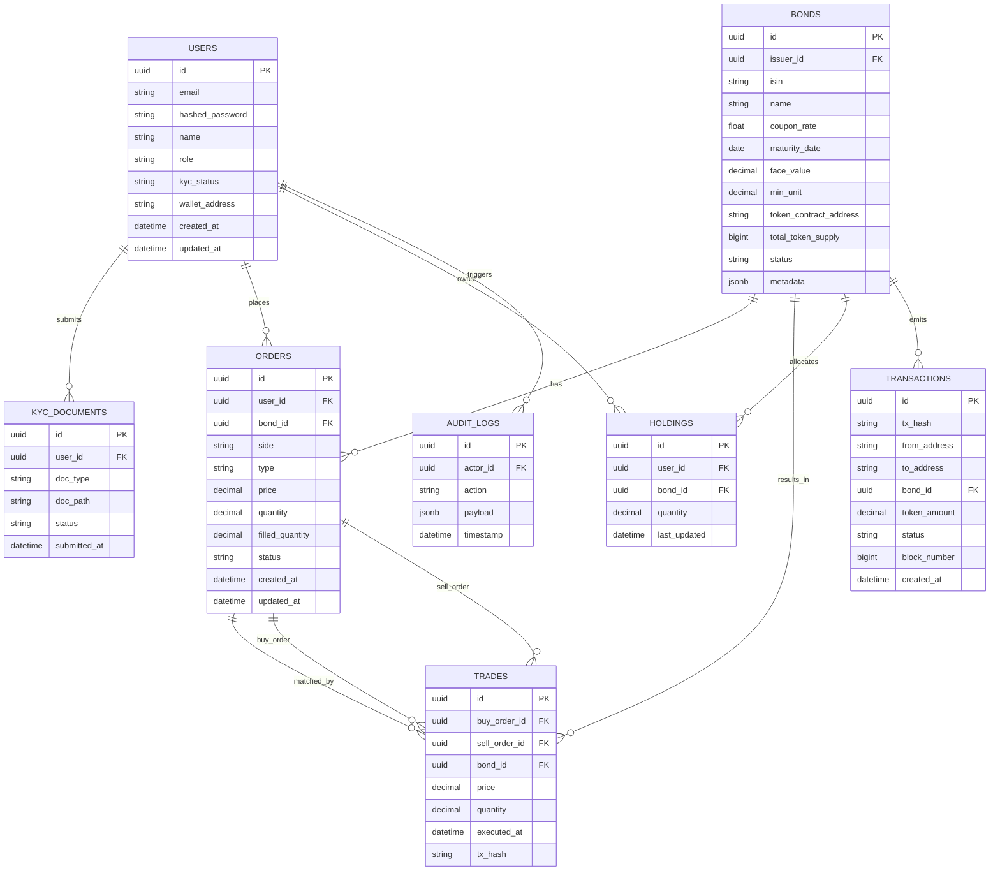

# Tokenized Bond Liquidity Platform — Architecture Diagrams

This README captures the architecture of the platform described (Next.js + FastAPI + PostgreSQL + Ethereum + AI/ML + DPI). Diagrams are rendered with Mermaid on GitHub.

## High‑level system overview

## End‑to‑end order lifecycle (sequence)

## Order matching and settlement logic (flow)

## Smart contracts and on‑chain interactions

## Database ER diagram (core)

## Deployment view (container/Kubernetes)

## Security architecture

## Blockchain settlement (DvP — demo)

## Notes

- GitHub renders Mermaid diagrams automatically. If viewing elsewhere, use a Mermaid-compatible renderer.
- The diagrams map exactly to the SRS/architecture text: components, data flows, contracts, ERD, deployment, and security.
- Adapt service names or add nodes (e.g., CDN, API Gateway) as your deployment evolves.
