# FractionFi: Tokenized Bond Liquidity Platform

**Revolutionizing Fixed Income Markets Through Blockchain & AI**

FractionFi is a comprehensive tokenized bond trading platform that democratizes access to fixed income markets through blockchain technology, AI-powered matching, and Digital Public Infrastructure (DPI) integration. Built with Next.js, FastAPI, PostgreSQL, Ethereum, and advanced AI/ML capabilities.

## 🎯 Problem Statement

```mermaid
mindmap
  root((Bond Market Challenges))
    Limited Liquidity
      Poor secondary market depth
      High bid-ask spreads
      Market fragmentation
    High Entry Barriers
      ₹1L+ minimum investments
      Complex paperwork
      Limited retail access
    Inefficient Settlement
      T+2 settlement cycles
      Counterparty risk
      Manual processes
    Information Asymmetry
      Limited price transparency
      Fragmented data sources
      Delayed market information
```



## � Platform Flow Diagrams

### User Onboarding & KYC Flow


### Bond Tokenization Flow


### Trading Workflow


### AI/ML Processing Flow


## �💡 Solution Overview


### Portfolio Management Flow


### Error Handling & Recovery Flow


### Compliance & Audit Flow


### WebSocket Real-time Communication Flow


### Data Processing Pipeline Flow


## 🏗️ Technology Architecture


## 📊 Market Impact Analysis


## 📊 Market Impact Analysis


## 🔐 Cybersecurity Framework


## 📈 Scalability Architecture


## 🏛️ SEBI Alignment Framework


## 🚀 Implementation Roadmap


## 💰 Business Model & Revenue Streams


## 🌍 Market Penetration Strategy

```mermaid
journey
    title User Acquisition Journey
    section Awareness
      Social Media: 3: User
      Industry Events: 4: User
      Partnership Marketing: 5: User
    section Interest
      Website Visit: 4: User
      Demo Request: 5: User
      Educational Content: 4: User
    section Consideration
      Free Trial: 5: User
      Consultation: 4: User
      Reference Checks: 3: User
    section Purchase
      Account Creation: 5: User
      KYC Completion: 4: User
      First Trade: 5: User
    section Retention
      Regular Trading: 5: User
      Premium Features: 4: User
      Referral Program: 5: User
```

## End‑to‑end order lifecycle (sequence)

```mermaid
sequenceDiagram
  autonumber
  participant User as User (Buyer/Seller)
  participant FE as Next.js Frontend
  participant API as FastAPI Backend
  participant DB as PostgreSQL
  participant ME as Matching Engine
  participant W3 as Web3 Provider
  participant ETH as Ethereum
  participant EL as Event Listener

  User->>FE: Place order (buy/sell)
  FE->>API: POST /orders (JWT)
  API->>DB: Insert order (status=open)
  API-->>FE: 201 Created (orderId)
  ME->>DB: Read best opposite orders
  ME->>DB: Create trade, update orders (filled/partial)
  ME->>API: Trigger settlement
  API->>W3: transferFrom/transfer (BondToken)
  W3->>ETH: Broadcast tx
  API->>DB: Insert transaction (pending, tx_hash)
  ETH-->>EL: Transfer event
  EL->>DB: Mark tx confirmed, update holdings
  API-->>FE: WS broadcast orderbook/trade/portfolio updates
```


## Order matching and settlement logic (flow)

```mermaid
flowchart TB
  A[New Order] --> B{Validate<br/>JWT KYC balance}
  B -- fail --> X[Reject 4xx]
  B -- ok --> C[Insert into orders<br/>status open]
  C --> D[Match engine picks order]
  D --> E{Opposite orders exist?}
  E -- no --> H[Wait in book]
  E -- yes --> F[Create trades<br/>price-time priority]
  F --> G{Settlement on-chain?}
  G -- yes --> I[Call transfer transferFrom<br/>BondToken] --> J[Record tx_hash<br/>status pending]
  G -- no --> K[Update off-chain holdings]
  J --> L[Listen for event]
  L --> M[Confirm update holdings]
  K --> M
  M --> N[Update orders<br/>filled cancelled]
  N --> O[Notify via WebSocket]
```


## Smart contracts and on‑chain interactions

```mermaid
flowchart LR
  subgraph Chain[Ethereum]
    BT[BondToken<br/>ERC-20 1400-like]
  end

  subgraph Offchain[Backend]
    API[FastAPI]
    EL[Event Listener]
    VAULT[Vault HSM]
  end

  API --> BT
  EL --> BT
  API --> VAULT
  EL --> VAULT
```
## Database ER diagram (core)

```mermaid
erDiagram
  USERS ||--o{ KYC_DOCUMENTS : submits
  USERS ||--o{ ORDERS : places
  USERS ||--o{ HOLDINGS : owns
  USERS ||--o{ AUDIT_LOGS : triggers

  BONDS ||--o{ ORDERS : has
  BONDS ||--o{ TRADES : results_in
  BONDS ||--o{ HOLDINGS : allocates
  BONDS ||--o{ TRANSACTIONS : emits

  ORDERS ||--o{ TRADES : matched_by
  TRADES }o--|| ORDERS : buy_order
  TRADES }o--|| ORDERS : sell_order

  USERS {
    uuid id PK
    string email
    string hashed_password
    string name
    string role
    string kyc_status
    string wallet_address
    datetime created_at
    datetime updated_at
  }

  KYC_DOCUMENTS {
    uuid id PK
    uuid user_id FK
    string doc_type
    string doc_path
    string status
    datetime submitted_at
  }

  BONDS {
    uuid id PK
    uuid issuer_id FK
    string isin
    string name
    float coupon_rate
    date maturity_date
    decimal face_value
    decimal min_unit
    string token_contract_address
    bigint total_token_supply
    string status
    jsonb metadata
  }

  ORDERS {
    uuid id PK
    uuid user_id FK
    uuid bond_id FK
    string side
    string type
    decimal price
    decimal quantity
    decimal filled_quantity
    string status
    datetime created_at
    datetime updated_at
  }

  TRADES {
    uuid id PK
    uuid buy_order_id FK
    uuid sell_order_id FK
    uuid bond_id FK
    decimal price
    decimal quantity
    datetime executed_at
    string tx_hash
  }

  HOLDINGS {
    uuid id PK
    uuid user_id FK
    uuid bond_id FK
    decimal quantity
    datetime last_updated
  }

  TRANSACTIONS {
    uuid id PK
    string tx_hash
    string from_address
    string to_address
    uuid bond_id FK
    decimal token_amount
    string status
    bigint block_number
    datetime created_at
  }

  AUDIT_LOGS {
    uuid id PK
    uuid actor_id FK
    string action
    jsonb payload
    datetime timestamp
  }
```


## 🥇 Competitive Advantage Analysis

```mermaid
graph TB
    A[FractionFi Platform] --> B[DPI Integration: 100%]
    A --> C[Blockchain Technology: 95%]
    A --> D[AI/ML Capabilities: 90%]
    A --> E[Settlement Speed: 95%]
    A --> F[Security Framework: 92%]
    A --> G[User Experience: 88%]
    A --> H[Regulatory Compliance: 85%]
    A --> I[Market Liquidity: 80%]
    
    style B fill:#4caf50,color:#fff
    style C fill:#4caf50,color:#fff
    style D fill:#2196f3,color:#fff
    style E fill:#4caf50,color:#fff
    style F fill:#ff9800,color:#fff
    style G fill:#2196f3,color:#fff
    style H fill:#ff9800,color:#fff
    style I fill:#ff5722,color:#fff
```

## 📊 Financial Projections

```mermaid
graph TB
    subgraph "Revenue Growth (₹ Crores)"
        A[Year 1: ₹10 Cr] --> B[Year 2: ₹50 Cr]
        B --> C[Year 3: ₹250 Cr]
        C --> D[Year 4: ₹500 Cr]
        D --> E[Year 5: ₹1000 Cr]
    end
    
    subgraph "User Growth (Millions)"
        F[Year 1: 0.1M] --> G[Year 2: 1M]
        G --> H[Year 3: 5M]
        H --> I[Year 4: 15M]
        I --> J[Year 5: 25M]
    end
    
    style A fill:#e3f2fd
    style C fill:#fff3e0
    style E fill:#e8f5e8
    style F fill:#f3e5f5
    style H fill:#fff3e0
    style J fill:#e8f5e8
```

## Deployment view (container/Kubernetes)

```mermaid
flowchart LR
  subgraph UserNet[Internet]
    U[Users]
  end

  subgraph K8s[Kubernetes]
    subgraph Ingress
      LB[Ingress LB<br/>TLS WAF]
    end

    subgraph Web
      FE[Deployment frontend<br/>Next.js]
    end

    subgraph API
      BE[Deployment backend<br/>FastAPI]
      WS[WebSocket]
      WKR[Deployment workers<br/>Celery RQ]
      REDIS[(Redis)]
    end

    subgraph Data
      PG[(PostgreSQL<br/>StatefulSet or Managed)]
      VAULT[Vault HSM]
    end

    subgraph Observability
      MON[(Prometheus<br/>Grafana)]
      SENTRY[Sentry]
    end
  end

  subgraph Web3[External]
    W3P[Web3 Provider]
    ETH[(Ethereum)]
  end

  U --> LB --> FE --> BE
  BE --> WS
  BE --> PG
  WKR --> PG
  BE --> REDIS
  WKR --> REDIS
  BE --> VAULT
  WKR --> VAULT
  BE --> MON
  BE --> SENTRY

  BE --> W3P
  W3P --> ETH
```
## Security architecture

```mermaid
flowchart TB
  subgraph IdP[Auth]
    JWT[JWT access refresh]
    RBAC[Role-based Access Control]
  end

  subgraph Secrets[Key Mgmt]
    VAULT[Vault HSM]
    SIGNER[Signer service<br/>custodial ops]
  end

  subgraph Backend[FastAPI]
    API[AuthN AuthZ Rate limit Validation]
    ADMIN[Admin endpoints]
  end

  Client[Next.js SPA] --> API
  API --> JWT
  API --> RBAC
  ADMIN --> SIGNER
  SIGNER --> VAULT

  API --> Client
  API --> AUDIT[(Audit)]
```
## Blockchain settlement (DvP — demo)

```mermaid
sequenceDiagram
  autonumber
  participant Buyer
  participant Seller
  participant API as Backend
  participant BT as BondToken
  participant W3 as Web3 Provider
  participant EL as Event Listener

  Seller->>BT: approve(API/custody, amount)
  Buyer->>API: Place buy order
  API->>API: Match with seller
  API->>W3: transferFrom(Seller, Buyer, amount)
  W3-->>BT: Execute transaction
  BT-->>EL: Transfer event
  EL->>API: Update holdings, mark trade settled
  API-->>Buyer: WS: portfolio updated
  API-->>Seller: WS: portfolio updated
```

## 🎯 Key Performance Indicators (KPIs)

```mermaid
graph LR
    subgraph "User Metrics"
        A[Monthly Active Users]
        B[User Retention Rate]
        C[Average Transaction Value]
    end
    
    subgraph "Market Metrics"
        D[Total Trading Volume]
        E[Market Liquidity Ratio]
        F[Price Discovery Efficiency]
    end
    
    subgraph "Technical Metrics"
        G[System Uptime 99.9%]
        H[Transaction Latency <100ms]
        I[Security Incidents: 0]
    end
    
    subgraph "Business Metrics"
        J[Revenue Growth Rate]
        K[Customer Acquisition Cost]
        L[Lifetime Value]
    end
    
    A --> D
    B --> E
    C --> F
    D --> J
    E --> K
    F --> L
```

## 🚀 Call to Action

```mermaid
flowchart LR
    A[🎯 Demo Ready] --> B[📋 SEBI Sandbox Application]
    B --> C[🤝 Strategic Partnerships]
    C --> D[💰 Series A Funding]
    D --> E[🌟 Market Launch]
    E --> F[🏆 Market Leadership]
    
    style A fill:#e1f5fe
    style B fill:#f3e5f5
    style C fill:#e8f5e8
    style D fill:#fff3e0
    style E fill:#fce4ec
    style F fill:#e0f2f1
```

### Ready for Transformation
- **Platform Status**: MVP ready for demonstration
- **Regulatory**: SEBI sandbox application prepared
- **Technology**: Production-ready architecture
- **Market**: Validated problem-solution fit
- **Timeline**: 6 months to market launch

**Contact Information:**
- **Website**: [FractionFi Platform]
- **Demo**: Live platform demonstration available
- **Partnership**: Open for strategic collaborations
- **Investment**: Series A funding round

---

*"Democratizing bond markets through blockchain innovation and Digital Public Infrastructure"*

**Built with ❤️ for India's financial inclusion mission**

---

## 📘 Detailed Technical Overview

This section provides a cohesive narrative (non-code) that ties together the architectural diagrams above and explains how FractionFi operates end‑to‑end.

### 1. Core Value Proposition
FractionFi converts traditional bond instruments into fractional, transferable digital representations and provides a unified venue where retail and institutional participants can trade them with improved liquidity, transparency, and eventual instant (or near‑instant) settlement. It bridges: (a) traditional fixed‑income issuance + compliance, (b) high‑performance off‑chain order management and matching, and (c) optional on‑chain settlement + digital custody.

### 2. Layered Architecture Summary
- Frontend Experience (Next.js 15 + TypeScript): Dynamic dashboards, order entry, portfolio visualization, WebSocket-driven real‑time updates, optional wallet connection for on‑chain flows.
- API & Orchestration (FastAPI): REST + WebSocket gateway handling auth (JWT), validation, order lifecycle, KYC orchestration, event broadcasting, and integration points (blockchain, DPI sources such as DigiLocker / Account Aggregator APIs).
- Matching & Trade Lifecycle: A price–time priority engine processes OPEN orders, creates TRADES, updates partial fills, and triggers settlement logic (off‑chain or on‑chain). Future enhancements include AI‑assisted order routing and liquidity provisioning.
- Data & State: PostgreSQL stores normalized core entities (Users, Bonds, Orders, Trades, Holdings, Transactions, Audit Logs). Redis (future optimization) handles ephemeral order book snapshots, pub/sub fan‑out, and caching hot lookups.
- Blockchain Layer (Hardhat / Ethereum): Optional settlement via token contracts (e.g., ERC‑20 or ERC‑1400 style). Smart contracts mint fractional bond tokens and record transfers for provenance. Event listeners reconcile on‑chain transfers with off‑chain state (double‑entry control + finality confirmation).
- DPI & Compliance Integrations: KYC, identity, and financial data rails plug into onboarding flow (DigiLocker docs, Account Aggregator statements, UPI payment rails for fiat on/off ramps). Compliance engines feed audit and surveillance modules.
- AI / ML Extensions: (Planned) pricing signals, risk scoring, anomaly/fraud detection, personalized investment recommendations; integrated through an inference gateway to keep the trading path deterministic and low latency.

### 3. End‑to‑End Order Path (Narrative)
1. User authenticates → receives JWT.
2. User submits an order (BUY/SELL) via REST.
3. API layer validates KYC status, role, balance (or reserved tokens) and persists the order as OPEN.
4. Matching engine wakes (poll or event trigger) and scans for crossing orders; if match found, it forms one or more trade executions.
5. For off‑chain settlement: holdings table is updated atomically and WebSocket broadcasts order + trade deltas.
6. For on‑chain settlement: engine (or async worker) calls token contract (transfer / mint / burn); a pending transaction record is stored with tx_hash.
7. Event listener confirms blockchain finality → updates transaction + trade status → broadcasts confirmation → portfolio recalculates.

### 4. Data Integrity & Auditability
Every material action (order creation, trade execution, settlement confirmation, KYC decision) emits an audit log entry. Separation of concerns between business tables and append‑only audit logs allows forensic replay. Planned deterministic hash chaining (a lightweight ledger) can further harden tamper detection.

### 5. Real‑Time Distribution Strategy
WebSockets push incremental updates (rather than full snapshots) for: order book, trades, portfolio changes. A subscription router can filter events per user or instrument group, enabling horizontal scale with sharded connection pools and a future message bus (Kafka / NATS) behind the dispatcher.

### 6. Security & Compliance Posture
- Authentication: JWT (short‑lived) + refresh token pattern (planned) + optional wallet signature login.
- Authorization: Role and (future) attribute-based policy hooks (admin / issuer / investor).
- Data Protection: PII separated from trading data; encryption at rest for sensitive columns; transport via TLS.
- Compliance: Rule engine to flag anomalous volumes / wash trading patterns; automated SAR/STR pipeline.

### 7. Scalability Roadmap (Practical Steps)
Phase 1: Single Postgres instance + in‑process matcher.
Phase 2: Background workers + Redis pub/sub + partial order book in memory.
Phase 3: External matching microservice + CQRS split (read replicas) + multi‑region WebSocket fan‑out.
Phase 4: Hybrid settlement (layer‑2 + mainnet) + cross‑venue routing + liquidity mining incentives.

### 8. Extensibility Points
- Adapter interfaces for: settlement backends (on‑chain vs custodial), pricing oracles, KYC providers.
- Event hooks for: trade executed, order canceled, user verified → enabling plugin modules (rewards, analytics, notifications).
- ABI/contract address registry for supporting multiple bond token classes or tranches.

### 9. Future Enhancements (Concrete)
- Proper Alembic migrations for tx_hash columns (remove ad‑hoc SQL script).
- Robust background scheduler for coupon accrual & distribution.
- Portfolio performance analytics (time‑weighted returns, yield to maturity aggregation).
- Multi‑asset expansion (commercial paper, securitized receivables, green bonds).
- RegTech API for automated regulatory filings (SEBI sandbox integration).

### 10. Why Hybrid (Off‑Chain + On‑Chain) Matters
Full on‑chain order books can face latency, MEV exposure, and gas cost friction. FractionFi leverages off‑chain deterministic matching for low latency, then anchors final settlement or ownership proofs on‑chain—balancing performance with transparency. This hybrid approach also facilitates compliance controls (pre‑trade KYC / AML gates) before state is externalized to public chains.

---

## 🖼️ Screenshots

Below are placeholder references to UI screenshots. Place your PNG/JPG files in `frontend/public/screenshot/` (create the folder if it does not yet exist). Once added, GitHub / a deployed static host will serve them under `/screenshot/<filename>`.

| Feature | Screenshot | Description |
|---------|------------|-------------|
| Dashboard |  | Overview: portfolio summary, recent trades, market movers. |
| Order Book |  | Live bid/ask levels streaming via WebSocket. |
| Trade Ticket |  | Order entry form with validation & wallet status. |
| Portfolio Detail |  | Holdings breakdown, cost basis, unrealized P/L. |
| Bond Detail |  | Instrument metadata (coupon, maturity, yield curve context). |
| KYC Flow |  | Stepwise onboarding with DPI provider integration. |
| On‑Chain Tx Confirmation |  | Display of transaction hash & settlement status. |

> If filenames differ, adjust the table accordingly. For remote hosting (e.g., a deployed Next.js site), strip the `frontend/public` prefix and use `/screenshot/<file>` paths.

### Adding Screenshots Quickly
1. Create the directory: `frontend/public/screenshot/`
2. Drop images (PNG/JPEG/SVG). Keep lowercase, hyphenated names.
3. Commit them: `git add frontend/public/screenshot/*`.
4. Verify in dev: start frontend → open `http://localhost:3000/screenshot/dashboard.png`.

### Accessibility Notes
Use concise `alt` text: e.g., `alt="Order book depth view"` so screen readers convey meaning.

---

## 🔍 Quick FAQ
**Is everything already on‑chain?** Not yet—current prototype focuses on off‑chain order + matching with a path to optional settlement contracts.

**How are partial fills handled?** The remaining quantity stays OPEN; fills produce trade rows until quantity is exhausted, then status becomes FILLED.

**What prevents double‑spending of tokens?** Off‑chain reserved balance (or locked custody) precedes contract invocation; on‑chain event confirmation reconciles final holdings.

**Can this support corporate bonds or green bonds?** Yes—extend the `Bonds` metadata schema with classification fields and integrate issuer workflows.

**How is price transparency improved?** Aggregated order book + trade tape + (future) AI fair value estimates surfaced in real time.

---

## 🗂️ Documentation Status Tracker (Current Snapshot)
| Domain | Status | Next Step |
|--------|--------|-----------|
| Schema / Migrations | Partial | Convert raw SQL to Alembic revision |
| Matching Engine | MVP | Add stress tests + latency benchmarks |
| WebSockets | Basic Broadcast | Add auth scopes & throttle |
| Portfolio Analytics | Minimal | Implement yield & duration metrics |
| Blockchain Settlement | Prototype | Expand to event-driven settlement queue |
| DPI Integrations | Planned | Build sandbox adapters & mock data |
| AI/ML Models | Planned | Define feature store + baseline models |
| Security Hardening | In Progress | Add rate limiting + structured audit review |

---

## ✅ How to Use This Documentation
Start with Problem Statement → Architecture diagrams → This Detailed Overview → Screenshots (visual context) → Roadmap / KPIs for strategic narrative. This layering lets an investor, regulator, or engineer each extract the level of depth they need without code digestion.
